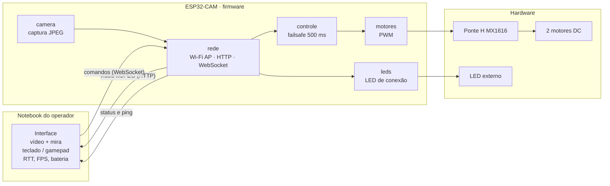

```mermaid
flowchart LR
  subgraph NB[Notebook do operador]
    UI[Interface<br/>vídeo + mira<br/>teclado / gamepad<br/>RTT, FPS, bateria]
  end
  subgraph ESP[ESP32-CAM · firmware]
    CAM[camera<br/>captura JPEG] --> REDE[rede<br/>Wi-Fi AP · HTTP · WebSocket]
    REDE --> CTRL[controle<br/>failsafe 500 ms]
    CTRL --> MOT[motores<br/>PWM]
    REDE --> LEDS[leds<br/>LED de conexão]
  end
  subgraph HW[Hardware]
    PH[Ponte H MX1616] --> M[2 motores DC]
    LED[LED externo]
  end
  REDE -- vídeo MJPEG (HTTP) --> UI
  UI -- comandos (WebSocket) --> REDE
  REDE -- status e ping --> UI
  MOT --> PH
  LEDS --> LED
```
